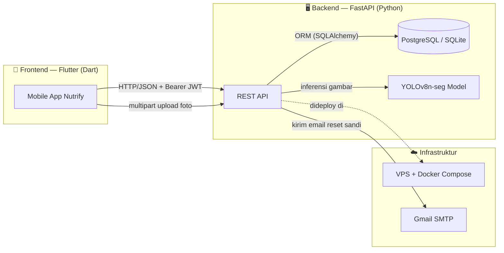
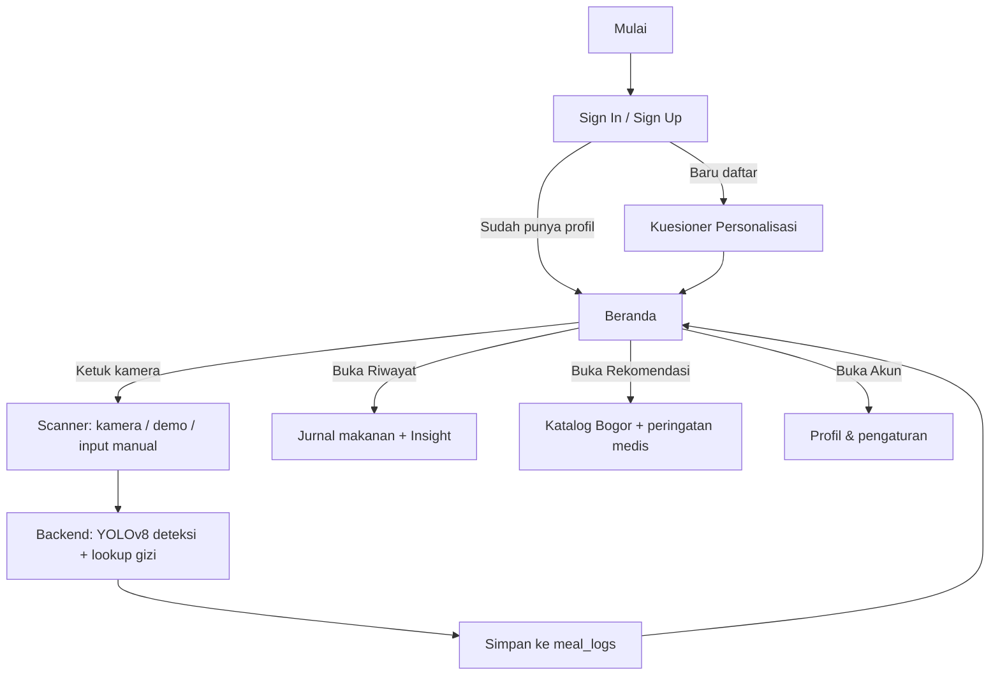

# Dokumentasi Lengkap Proyek Nutrify: Asisten Nutrisi Cerdas Berbasis AI untuk Makanan Khas Bogor

## Identitas Proyek

| | |
|---|---|
| **Nama Proyek** | Nutrify — Smarter Nutrition for a Better You |
| **Jenis** | Penulisan Ilmiah (PI) |
| **Penulis** | Danar Mas Saputra |
| **NPM / Kelas** | 50423331 / 3IA02 |
| **Universitas** | Universitas Gunadarma |
| **Periode pengembangan** | 11 Juni 2026 – 16 Juli 2026 (±5 minggu, 52 commit) |
| **Ukuran basis kode** | ±13.600 baris Dart (frontend), ±1.250 baris Python (backend) |

Nutrify adalah aplikasi asisten nutrisi pribadi bertenaga AI yang mengidentifikasi jenis dan kandungan gizi makanan khas Bogor dari foto (Asinan Bogor, Cungkring, Doclang, Laksa, Toge Goreng), mencatatnya ke dalam jurnal makanan harian, serta memberikan rekomendasi dan peringatan medis yang dipersonalisasi berdasarkan profil kesehatan pengguna.

---

## 1. Latar Belakang & Tujuan

**Latar belakang.** Bogor memiliki kekayaan kuliner tradisional, namun banyak masyarakat — terutama pendatang dan wisatawan — belum mengenal jenis maupun kandungan gizi dari hidangan-hidangan tersebut. Di sisi lain, meningkatnya kesadaran pola makan sehat mendorong kebutuhan alat bantu yang dapat mengidentifikasi makanan sekaligus menampilkan estimasi nutrisinya secara cepat.

**Tujuan.** Membangun (1) model *computer vision* (YOLOv8 *instance segmentation*) yang mampu mendeteksi lima kelas makanan khas Bogor dan mengevaluasi performanya dengan metrik mAP, serta (2) mendemonstrasikan integrasi model tersebut secara *end-to-end* dengan aplikasi mobile dan basis data nutrisi tabular, sehingga setiap hidangan yang terdeteksi langsung menampilkan estimasi kandungan gizinya.

**Ruang lingkup & batasan** (sesuai *notebook* riset model):
- Model dibatasi pada lima kelas makanan khas Bogor: *Doclang, Toge Goreng, Cungkring* (kategori autentik Bogor), serta *Laksa Bogor* dan *Asinan Bogor* (kategori varian Bogor yang diakui).
- Cakupan model hanya pada lapisan deteksi/segmentasi citra. Estimasi berat porsi dan pencarian data nutrisi ditangani di sisi backend, di luar fokus utama pemodelan.
- Basis data nutrisi (`clean_dataset.csv`, ±2.010 makanan Indonesia) digunakan sebatas *lookup*, bukan diolah ulang sebagai data latih.

---

## 2. Arsitektur Sistem

Sistem terdiri dari tiga komponen utama yang saling terhubung lewat REST API:



- **Frontend**: aplikasi mobile Flutter (Android-first), mengonsumsi API lewat satu *service layer* (`ApiService`).
- **Backend**: FastAPI, menangani autentikasi, personalisasi, jurnal makanan, pencarian gizi, dan inferensi AI.
- **Model AI**: YOLOv8n-seg dimuat langsung di proses backend (bukan *microservice* terpisah) dan dipanggil sinkron saat endpoint `/api/meals/scan-image` diakses.
- **Basis data**: PostgreSQL di produksi (VPS), dengan *fallback* otomatis ke SQLite lokal (`local_nutrify.db`) jika koneksi Postgres gagal — berguna untuk pengembangan/demo tanpa server database.
- **Deployment**: backend dikemas sebagai *container* Docker tunggal, dijalankan di VPS lewat `docker compose up -d --build`.

---

## 3. Struktur Direktori Proyek

```
project-pi/
├── ai-model/
│   ├── YOLOv8_BogorNutritionFood_PI.ipynb   # notebook riset & training model
│   ├── bogor_yolo_best.pt                   # bobot model terlatih (~6.5 MB)
│   └── clean_dataset.csv                    # dataset gizi (±2.010 makanan)
│
├── backend/                                 # FastAPI
│   ├── app/
│   │   ├── core/          # config.py, database.py, security.py
│   │   ├── models/        # user.py, personalization.py, password_reset.py, food.py, meal.py
│   │   ├── routers/       # auth.py, chat.py, personalization.py, health.py, meal.py
│   │   ├── schemas/       # auth.py, chat.py, personalization.py, meal.py
│   │   ├── services/      # chat_service.py, email_service.py
│   │   └── main.py        # entrypoint, CORS, migrasi ringan, startup
│   ├── tests/              # pytest — auth, otorisasi meal, scan makanan
│   ├── clean_dataset.csv   # salinan dataset gizi untuk seeding basis data
│   ├── requirements.txt
│   └── Dockerfile
│
└── frontend/                                # Flutter
    └── lib/
        ├── core/
        │   ├── services/   # api_service.dart, date_helper.dart
        │   ├── theme/      # app_theme.dart
        │   └── widgets/    # brand_header, custom_painters, meal_image, top_toast, dst.
        ├── features/
        │   ├── splash/            onboarding/         auth/
        │   ├── personalization/   dashboard/          scanner/
        │   ├── history/           recommendations/     chatbot/
        │   └── profile/
        └── main.dart
```

Pola tiap fitur mengikuti struktur *feature-first*: `features/<nama_fitur>/presentation/{pages,widgets}` — bukan Clean Architecture penuh (tidak ada pemisahan `domain`/`data` layer eksplisit kecuali di modul `onboarding`).

---

## 4. Teknologi & Dependensi

### 4.1 Frontend (Flutter)

| Package | Versi | Fungsi |
|---|---|---|
| `flutter` SDK | ^3.9.0 | Framework UI utama |
| `http` | ^1.2.2 | Klien HTTP ke backend (dipakai langsung, tanpa Dio/Retrofit) |
| `google_fonts` | ^6.2.1 | Font *Plus Jakarta Sans* untuk seluruh tipografi |
| `shared_preferences` | ^2.2.3 | Penyimpanan lokal (token sesi, cache personalisasi, air minum harian) |
| `camera` | ^0.11.1 | Akses kamera perangkat untuk pemindaian makanan |
| `image_picker` | ^1.1.2 | Pengambilan foto dari galeri sebagai alternatif kamera |
| `provider` | ^6.1.2 | *Terdaftar di `pubspec.yaml` namun tidak dipakai* — manajemen state aktual memakai `StatefulWidget`/`setState` biasa |
| `flutter_lints`, `flutter_launcher_icons` | dev-only | Linting & pembuatan ikon aplikasi |

**Manajemen state**: tidak memakai *state management library* khusus. Setiap halaman menyimpan state lokal via `setState`, data server diambil langsung per-halaman tanpa lapisan cache/query, dan konsistensi lintas-tab (mis. tab Beranda ↔ Riwayat) ditangani manual memakai `GlobalKey` + *callback* eksplisit.

### 4.2 Backend (FastAPI / Python)

| Package | Versi | Fungsi |
|---|---|---|
| `fastapi` | 0.138.1 | Framework REST API |
| `uvicorn` | 0.49.0 | ASGI server |
| `SQLAlchemy` | 2.0.51 | ORM ke PostgreSQL/SQLite |
| `psycopg2-binary` | 2.9.12 | Driver PostgreSQL |
| `pydantic` | 2.13.4 | Validasi skema request/response |
| `python-jose[cryptography]` | 3.3.0 | Pembuatan & verifikasi JWT |
| `bcrypt` | 5.0.0 | *Hashing* kata sandi |
| `python-multipart` | 0.0.32 | Menerima *upload* file (foto pemindaian) |
| `python-dotenv` | 1.2.2 | Memuat variabel lingkungan dari `.env` |
| `email-validator`, `dnspython` | — | Validasi format alamat email |
| `ultralytics` | 8.3.59 | Runtime inferensi model YOLOv8 |
| `numpy` | 1.26.4 | *(dipatok versi ini — lihat §11 soal kompatibilitas VPS)* |
| `pytest`, `httpx` | 8.3.4 / 0.28.1 | Pengujian otomatis backend |

### 4.3 Infrastruktur

- **Kontainerisasi**: `Dockerfile` berbasis `python:3.12-slim`, memasang `libgl1`/`libglib2.0-0` (dependensi OpenCV untuk YOLO), lalu menjalankan `uvicorn app.main:app`.
- **Database produksi**: PostgreSQL; **fallback lokal**: SQLite (`backend/local_nutrify.db`), dipilih otomatis oleh `core/database.py` bila koneksi Postgres gagal.
- **Email**: SMTP Gmail (`smtplib`, STARTTLS) untuk mengirim tautan pemulihan kata sandi.
- **API produksi**: `https://api-nutrify.<domain-anda>` (dipakai langsung sebagai `baseUrl` di `ApiService` — belum ada pemisahan environment dev/staging/prod).

---

## 5. Model Kecerdasan Buatan — YOLOv8 Instance Segmentation

### 5.1 Arsitektur & Konfigurasi Training

| Parameter | Nilai |
|---|---|
| Arsitektur dasar | `yolov8n-seg.pt` (*nano*, *instance segmentation*, transfer learning dari bobot pretrained COCO) |
| Jumlah kelas | 5 — `Asinan Bogor`, `Cungkring`, `Doclang`, `Laksa`, `Toge Goreng` |
| Epoch | 100 (maksimum), `patience=20` (*early stopping*) |
| Resolusi input | 640×640 |
| Batch size | 16 |
| Optimizer | AdamW, `lr0=0.001`, `lrf=0.01` |
| Environment training | Google Colab, GPU Tesla T4 |
| Ukuran model akhir | 86 layer, 3.259.039 parameter, 11,3 GFLOPs |
| Lokasi bobot | `ai-model/bogor_yolo_best.pt` (~6,5 MB) |

### 5.2 Dataset

- Sumber: koleksi citra pribadi diberi anotasi lewat **Roboflow**, diekspor dalam format YOLO segmentation (polygon).
- Disimpan di Google Drive (`Nutrify_AI_Mobile-PI-Gundar/Datasets/Dataset_Image/Clean`).
- Ekspor awal hanya berisi split `train` (316 gambar); split `valid`/`test` dibuat ulang secara lokal dengan rasio **70% / 20% / 10%**.
- Pemeriksaan kualitas data dilakukan sebelum training: validasi pasangan gambar–label yang hilang, serta deteksi label kosong dan file gambar korup.

### 5.3 Hasil Evaluasi (pada *split* test, 36 gambar / 38 instance)

| Kelas | Gambar | Instance | Precision | Recall | mAP50 | mAP50-95 |
|---|---|---|---|---|---|---|
| **Keseluruhan** | 36 | 38 | 0,881 | 0,834 | **0,927** | 0,735 (box) / 0,759 (mask) |
| Asinan Bogor | 9 | 10 | 0,934 | 0,800 | 0,913 | 0,767 |
| Cungkring | 6 | 6 | 0,939 | 1,000 | 0,995 | 0,616 |
| Doclang | 8 | 8 | 0,842 | 0,750 | 0,927 | 0,790 |
| Laksa | 6 | 6 | 0,848 | 0,936 | 0,972 | 0,820 |
| Toge Goreng | 7 | 8 | 0,844 | 0,684 | 0,829 | 0,681 |

**Kecepatan inferensi** (GPU Tesla T4): 15,9 ms *preprocess* + 38,9 ms *inference* + 6,8 ms *postprocess* per gambar. Di produksi (VPS, CPU-only), latensi jauh lebih tinggi karena tidak ada akselerasi GPU.

### 5.4 Integrasi ke Backend

Model dimuat sekali saat backend menyala (`app/routers/meal.py`), lalu dipanggil langsung (bukan lewat *job queue*) di endpoint `POST /api/meals/scan-image`:

1. Foto diunggah → disimpan dengan nama acak (UUID) di `backend/uploads/`.
2. Model memprediksi *bounding box* + kelas + *confidence*; kotak dengan *confidence* tertinggi dipilih.
3. Deteksi dengan *confidence* **< 0,15** (`CONFIDENCE_THRESHOLD`) dianggap tidak valid → direspons sebagai "Tidak Terdeteksi".
4. **Estimasi porsi**: rasio luas *bounding box* terhadap luas gambar dibandingkan dengan rasio *baseline* 0,35, menghasilkan `portion_scale` yang dibatasi ke rentang **0,85–1,25** — heuristik kasar untuk menyesuaikan estimasi kalori dengan seberapa besar makanan tampak dalam bingkai foto.
5. Nama kelas hasil deteksi dicocokkan ke basis data gizi (`scan_meal`) untuk memperoleh estimasi kalori/protein/karbohidrat/lemak, dikalikan `portion_scale`.

### 5.5 Keterbatasan Model

- Hanya lima kelas yang dikenali; makanan Bogor lain (atau makanan non-Bogor) akan gagal terdeteksi atau salah klasifikasi.
- Dataset training relatif kecil (316 gambar mentah sebelum *split*), sehingga rawan *overfitting* pada variasi pencahayaan/sudut foto yang belum terwakili.
- Estimasi porsi murni berbasis rasio luas kotak deteksi terhadap bingkai foto — tidak memperhitungkan jarak kamera/perspektif sungguhan, sehingga akurasinya terbatas.
- Inferensi berjalan di CPU pada server produksi (tanpa GPU), sehingga jauh lebih lambat dibanding hasil benchmark saat training di Colab.

---

## 6. Basis Data

### 6.1 Skema Tabel

**`users`**
| Kolom | Tipe | Keterangan |
|---|---|---|
| `email` | String (PK) | |
| `name` | String | |
| `password` | String | Hash bcrypt (mendukung migrasi otomatis dari teks polos lama) |

**`personalizations`** (1–1 dengan `users`)
| Kolom | Tipe | Keterangan |
|---|---|---|
| `email` | String (PK, FK→users) | |
| `name`, `dob`, `gender`, `activity`, `goal` | String | |
| `height`, `weight` | Float | |
| `conditions`, `allergies`, `restrictions`, `preferences` | JSON | Daftar pilihan multi-select |
| `other_conditions`, `notes` | String, nullable | |

**`password_reset_tokens`**
| Kolom | Tipe | Keterangan |
|---|---|---|
| `token` | String (PK) | `secrets.token_urlsafe(32)` |
| `email` | String (FK→users) | |
| `created_at`, `expires_at` | DateTime | Kedaluwarsa 30 menit, *cooldown* permintaan ulang 60 detik |
| `used` | Boolean | |

**`foods`** — basis data gizi acuan (diisi otomatis dari `clean_dataset.csv`, ±2.010 baris unik, sekali saat pertama kali server menyala)
| Kolom | Tipe |
|---|---|
| `food_name` (PK), `serving_size_g`, `calories`, `protein`, `fat`, `carbohydrates`, `sugar`, `sodium`, `fiber` | String / Float |
| `calories_from_macro`, `protein_per_calorie`, `fat_per_calorie`, `carbs_per_calorie` | Float, nullable |
| `calorie_category`, `is_high_protein`, `is_high_fiber`, `is_high_sodium` | String / Integer |

**`meal_logs`** — jurnal makanan pengguna
| Kolom | Tipe | Keterangan |
|---|---|---|
| `id` | Integer (PK, autoincrement) | |
| `email` | String (FK→users) | |
| `food_name`, `components`, `timestamp`, `image_path` | String | |
| `calories`, `protein`, `carbs`, `fat` | Float | **Nilai dasar** (setara porsi = 1), dikalikan `portion` saat ditampilkan |
| `health_score` | Integer | |
| `is_manual` | Boolean | |
| `portion` | Float, default 1.0 | Pengali porsi (ditambahkan lewat migrasi) |
| `ingredients_detail` | Text, nullable | JSON rincian per-bahan (nama, berat, kalori, makro) — ditambahkan lewat migrasi agar perubahan bahan tidak "reset" saat halaman dibuka ulang |

### 6.2 Strategi Migrasi

Proyek ini **tidak memakai Alembic** atau *migration framework* formal. Sebagai gantinya, `app/main.py` menjalankan fungsi migrasi ringan berbasis `ALTER TABLE ... ADD COLUMN` yang dibungkus `try/except` (gagal senyap bila kolom sudah ada) setiap kali server menyala — cukup untuk skala proyek ini, namun tidak *robust* untuk skema yang lebih kompleks atau *rollback*. Tiga migrasi yang pernah dijalankan: kolom `portion`, kolom `created_at` pada `password_reset_tokens`, dan kolom `ingredients_detail`.

---

## 7. Daftar Lengkap API Endpoint

Semua *response* berformat JSON. Endpoint bertanda 🔒 memerlukan header `Authorization: Bearer <JWT>` dan memvalidasi bahwa `email` pada payload/parameter cocok dengan identitas token (mencegah pengguna mengakses data pengguna lain).

| Method | Path | Auth | Deskripsi |
|---|---|---|---|
| `POST` | `/api/auth/signup` | – | Registrasi akun baru, langsung aktif + JWT dikembalikan |
| `POST` | `/api/auth/signin` | – | Login, verifikasi bcrypt, kembalikan JWT + status personalisasi |
| `POST` | `/api/auth/forgot-password` | – | Buat token reset, kirim tautan lewat email |
| `GET` | `/reset-password` | – | Halaman HTML form atur ulang kata sandi (dibuka dari tautan email) |
| `POST` | `/reset-password` | – | Proses submit form reset kata sandi |
| `POST` | `/api/chat` | – | Chatbot berbasis aturan kata kunci (bukan LLM) |
| `POST` | `/api/personalization` | 🔒 | Simpan/perbarui data personalisasi (upsert) |
| `GET` | `/api/personalization/{email}` | 🔒 | Ambil data personalisasi pengguna |
| `GET` | `/health` | – | *Health check* server |
| `GET` | `/api/foods/search?q=` | – | Cari makanan di basis data gizi (ILIKE, maks. 10 hasil) |
| `POST` | `/api/meals/scan` | – | Cari estimasi gizi berdasarkan nama makanan (teks manual) |
| `POST` | `/api/meals/scan-image` | – | Unggah foto → deteksi YOLO → estimasi gizi + porsi |
| `POST` | `/api/meals` | 🔒 | Simpan entri jurnal makanan baru |
| `GET` | `/api/meals?email=&limit=&offset=` | 🔒 | Daftar jurnal makanan pengguna (default limit 500, maks 1000) |
| `PUT` | `/api/meals/{meal_id}` | 🔒 | Perbarui sebagian entri jurnal (payload fleksibel berbasis dict) |
| `DELETE` | `/api/meals/{meal_id}` | 🔒 | Hapus entri jurnal |
| `GET` | `/uploads/{filename}` | – | Berkas statis foto hasil pemindaian |

---

## 8. Keamanan

- **Kata sandi**: di-*hash* dengan `bcrypt`. Terdapat jalur migrasi otomatis: bila kata sandi lama tersimpan sebagai teks polos (data lama), sistem memverifikasi lalu langsung meng-*upgrade*-nya ke bcrypt saat login berhasil.
- **Sesi**: JWT (algoritma **HS256**), masa berlaku dapat dikonfigurasi lewat `JWT_EXPIRE_MINUTES` (default 1440 menit / 24 jam). Kunci rahasia diambil dari variabel lingkungan `JWT_SECRET_KEY` — **catatan**: kode memiliki nilai *default fallback* yang tidak aman jika variabel lingkungan lupa di-set di produksi; pastikan `.env` produksi selalu mengisi nilai ini secara eksplisit.
- **Otorisasi berbasis kepemilikan**: setiap endpoint yang menyentuh data milik pengguna (`/api/meals*`, `/api/personalization/*`) memverifikasi bahwa identitas di token JWT cocok dengan `email` yang diminta/dimiliki data, mengembalikan `403 Forbidden` jika tidak cocok — diuji eksplisit lewat `backend/tests/test_meal_authorization.py`.
- **Upload file**: nama file disimpan dengan UUID acak, menghindari *path traversal* dan tabrakan nama.
- **CORS**: kebijakan saat ini `allow_origins=["*"]` (terbuka untuk semua origin) — wajar untuk tahap pengembangan/skala kecil, namun perlu dipersempit bila diproduksi lebih luas.

---

## 9. Modul Fitur Frontend

| Modul | Ringkasan |
|---|---|
| `splash` | Layar pembuka saat aplikasi dimuat |
| `onboarding` | Carousel perkenalan aplikasi untuk pengguna baru |
| `auth` | Sign in, sign up, lupa kata sandi |
| `personalization` | Wizard 3 langkah: data fisik & aktivitas, tujuan, kondisi kesehatan |
| `dashboard` | Tab utama — beranda (ringkasan gizi harian, kalender, pelacak air minum, pratinjau riwayat), serta halaman detail makanan (penyesuaian porsi, CRUD bahan) |
| `scanner` | Kamera pemindai (mode asli & demo), input manual dengan preset cepat, alur analisis AI |
| `history` | Jurnal makanan lengkap dengan filter rentang waktu, kartu ringkasan, dan kartu *insight* dinamis |
| `recommendations` | Katalog makanan khas Bogor, target gizi personal (Harris-Benedict), peringatan berbasis kondisi medis |
| `chatbot` | Asisten gizi berbasis aturan kata kunci |
| `profile` | Pengaturan akun, perangkat terhubung (simulasi), notifikasi, pusat bantuan, privasi, tentang aplikasi |

**Widget inti bersama** (`core/widgets`): `brand_header`, `custom_painters` (dekorasi *viewfinder* kamera & navigasi), `custom_text_field`, `meal_image` (gambar jaringan dengan *fallback*), `primary_button`, `skeleton` (placeholder *loading*), `social_button`, `top_toast` (notifikasi *overlay* dari atas layar).

---

## 10. Alur Kerja Sistem End-to-End



### 10.1 Autentikasi & Pemulihan Kata Sandi
Registrasi memakai email + kata sandi (bcrypt), langsung aktif tanpa verifikasi tautan. Login memverifikasi kredensial dan mengembalikan JWT 24 jam. Pemulihan kata sandi memakai tautan bertoken via email (kedaluwarsa 30 menit), diarahkan ke halaman web sederhana (bukan di dalam aplikasi) untuk mengatur kata sandi baru.

### 10.2 Personalisasi & Perhitungan Target Gizi (Harris-Benedict)
Setelah registrasi, pengguna mengisi data fisik (tinggi, berat, jenis kelamin, tanggal lahir), tingkat aktivitas, tujuan (turun/naik/jaga berat badan, tambah massa otot), dan riwayat penyakit. Target kalori dihitung dinamis di sisi frontend:
1. **BMR** (Harris-Benedict): Pria = 88,362 + (13,397×berat) + (4,799×tinggi) − (5,677×usia); Wanita = 447,593 + (9,247×berat) + (3,098×tinggi) − (4,330×usia).
2. **TDEE** = BMR × pengali aktivitas (1,2 / 1,375 / 1,55 / 1,725).
3. Penyesuaian berdasarkan tujuan (±500 kkal turun/naik berat, +300 kkal tambah otot) beserta rasio makro berbeda per tujuan.
4. Intervensi rasio makro tambahan untuk Diabetes (karbo dipangkas ≤35%) dan Kolesterol Tinggi (lemak dipangkas ≤20%).

### 10.3 Pemindaian Makanan (Scanner)
Pengguna memotret makanan (atau memakai mode demo/preset manual bila tanpa kamera nyata). Untuk foto asli, gambar dikirim ke `/api/meals/scan-image`; untuk input manual/preset, nama makanan dikirim ke `/api/meals/scan`. Hasil (nama, estimasi kalori/makro, deskripsi, skor kesehatan) ditampilkan untuk dikonfirmasi pengguna sebelum disimpan ke jurnal (`POST /api/meals`).

### 10.4 Detail Makanan, Porsi, dan Rincian Bahan
Di halaman detail makanan, pengguna dapat menyesuaikan porsi (kelipatan 0,5×, rentang 0,5–5,0×), mengedit nilai makro langsung, serta menambah/mengedit/menghapus bahan individual (dengan pencarian ke basis data gizi). Nilai dasar (`calories`, dst.) dan pengali `portion` disimpan terpisah — tampilan akhir selalu `nilai_dasar × portion`. Rincian bahan lengkap disimpan sebagai `ingredients_detail` agar konsisten saat halaman dibuka kembali.

### 10.5 Riwayat & Insight
Tab Riwayat menampilkan seluruh jurnal makanan dengan filter rentang (Semua/Minggu Ini/Bulan Ini), total kalori & protein, serta kartu **Insight** yang membandingkan total kalori periode terpilih terhadap target harian (≥100% tercapai, 70–99% mendekati, <70% masih jauh, atau kosong bila belum ada catatan).

### 10.6 Rekomendasi & Peringatan Medis
Tab Rekomendasi menyajikan katalog lima makanan khas Bogor beserta info gizi per 100 g. Saat salah satu diketuk, sistem mencocokkan kondisi kesehatan pengguna dengan kandungan gizi makanan tsb.: Diabetes ↔ karbohidrat >15 g, Hipertensi ↔ natrium >150 mg, Kolesterol Tinggi ↔ lemak >10 g / makanan bersantan, Asam Urat ↔ makanan jeroan (mis. Cungkring), Maag/GERD ↔ makanan asam/pedas (mis. Asinan Bogor).

---

## 11. Catatan Perbaikan & Iterasi Signifikan

Ringkasan perbaikan besar yang dilakukan selama iterasi pengembangan — relevan sebagai catatan proses pada laporan penelitian:

| # | Masalah | Perbaikan |
|---|---|---|
| 1 | Basis data numpy tidak kompatibel dengan CPU VPS (kurang dukungan instruksi x86 modern); backend PyTorch/oneDNN gagal dengan galat *"could not create a primitive"* di CPU VPS (tanpa AVX2) | Menetapkan Python 3.12 + `numpy==1.26.4`; menonaktifkan `torch.backends.mkldnn.enabled` dan menambah `ONEDNN_MAX_CPU_ISA=SSE41` di Dockerfile |
| 2 | Penyesuaian porsi (+/−) tersimpan ke database, tetapi kolom `calories`/`protein`/dst. tetap berupa nilai dasar (pra-pengali) — semua layar selain halaman detail membaca nilai mentah tanpa mengalikan `portion`, sehingga total di Beranda/Riwayat tidak pernah berubah walau porsi diubah | Mengalikan `portion` secara konsisten di semua tempat yang menampilkan/menjumlahkan nilai gizi |
| 3 | Rincian bahan makanan (berat, kalori per-bahan, kuantitas kustom) tidak pernah disimpan — hanya ditebak ulang dari nama tiap kali halaman dibuka, sehingga edit kustom "reset" ke nilai generik | Menambah kolom `ingredients_detail` (JSON) dan selalu menyimpan/memuat rincian yang persis sama |
| 4 | Fitur pemindaian selalu mencatat tanggal hari ini, mengabaikan tanggal yang sedang dipilih di kalender Beranda | Meneruskan `selectedDate` terpilih ke Scanner dan memakainya untuk bagian tanggal pada *timestamp* |
| 5 | Kartu *Insight* di tab Riwayat statis — selalu menampilkan pesan "sudah mencapai target" apa pun datanya | Menghubungkan kartu ke progres kalori nyata dengan ambang batas pesan dinamis |
| 6 | Notifikasi (`SnackBar`) selalu muncul di bawah layar, kurang terlihat | Diganti ke *overlay* kustom `showTopToast` yang muncul dari atas, di seluruh aplikasi |
| 7 | Tab Beranda dan Riwayat sama-sama aktif lewat `IndexedStack` namun mengambil data secara independen — perubahan di satu tab tidak terlihat di tab lain tanpa *pull-to-refresh* manual | Menjembatani keduanya lewat `GlobalKey` + *callback* `onMealsChanged` agar saling memperbarui otomatis |
| 8 | Beberapa tempat UI (preset scanner, katalog rekomendasi, balasan chatbot) menyebut "Soto Kuning Bogor" sebagai makanan yang bisa dikenali, padahal model YOLO yang sebenarnya tidak pernah dilatih untuk kelas tersebut (5 kelas asli: Asinan Bogor, Cungkring, Doclang, Laksa, Toge Goreng) | Mengoreksi seluruh referensi menjadi "Cungkring" agar selaras dengan kelas model yang sebenarnya |

**Cakupan pengujian otomatis** (`backend/tests/`, memakai `pytest` + `httpx`): 19 kasus uji mencakup — alur *signup*/*signin*, penolakan kata sandi salah, email duplikat, *roundtrip hashing* kata sandi, *rate limit* lupa kata sandi; pencarian & pemindaian makanan (termasuk kasus khusus Cungkring, makanan tak dikenal, *query* kosong); serta siklus CRUD jurnal makanan lengkap dengan verifikasi otorisasi kepemilikan data (`test_meal_authorization.py`). Frontend memiliki pengujian unit ringan (`frontend/test/`) untuk `date_helper` (pemformatan tanggal relatif) dan widget `meal_image`.

---

## 12. Menjalankan Proyek Secara Lokal

### A. Backend (FastAPI)
```bash
cd backend
python3 -m venv venv
source venv/bin/activate
pip install -r requirements.txt
uvicorn main:app --host 0.0.0.0 --port 8000 --reload
```

### B. Frontend (Flutter)
```bash
cd frontend
flutter pub get
flutter run
```

Skrip pintasan `run.sh` di root proyek juga tersedia: `./run.sh backend`, `./run.sh frontend`, `./run.sh mobile` (buka emulator tertentu), atau tanpa argumen untuk menjalankan keduanya sekaligus.

---

## 13. Deployment Produksi (VPS + Docker)

Backend dikemas dengan Docker sehingga pemutakhiran di VPS cukup satu rangkaian perintah:

```bash
ssh <user>@<IP_VPS> -p <PORT_SSH>
cd project-pi/backend
git pull origin main
docker compose up -d --build
docker compose logs -f   # memantau log berjalan
```

Basis data produksi memakai PostgreSQL; variabel lingkungan (`DATABASE_URL`, `JWT_SECRET_KEY`, `JWT_EXPIRE_MINUTES`, `SMTP_EMAIL`, `SMTP_APP_PASSWORD`, `PUBLIC_BASE_URL`) dikonfigurasi lewat berkas `.env` yang **tidak disertakan di repositori** (lihat `.gitignore`).

---

## 14. Keterbatasan & Rencana Pengembangan Selanjutnya

- **Model AI** hanya mengenali lima kelas makanan Bogor; perluasan kelas memerlukan dataset baru beserta pelatihan ulang.
- **Estimasi porsi** dari rasio luas kotak deteksi adalah heuristik kasar, bukan pengukuran volume/berat sungguhan — kandidat perbaikan: estimasi kedalaman (*depth estimation*) atau referensi objek skala (mis. piring standar).
- **Tidak ada *migration framework* formal** (Alembic) — perubahan skema mengandalkan skrip `ALTER TABLE` manual yang dibungkus *try/except*.
- **Tidak ada pemisahan environment** (dev/staging/prod) di frontend — `baseUrl` API produksi ter-*hardcode* di `ApiService`.
- **Manajemen state frontend** murni `setState` tanpa lapisan *state management*/*caching* terpusat; skalabilitas ke fitur yang lebih kompleks (mis. sinkronisasi *offline*) akan memerlukan refactor arsitektur.
- **Kebijakan CORS** masih terbuka penuh (`allow_origins=["*"]`) — perlu dipersempit bila aplikasi dirilis ke publik lebih luas.
- **Chatbot** masih berbasis pencocokan kata kunci sederhana (bukan model bahasa/LLM) — ruang pengembangan ke arah asisten gizi yang lebih kontekstual.
